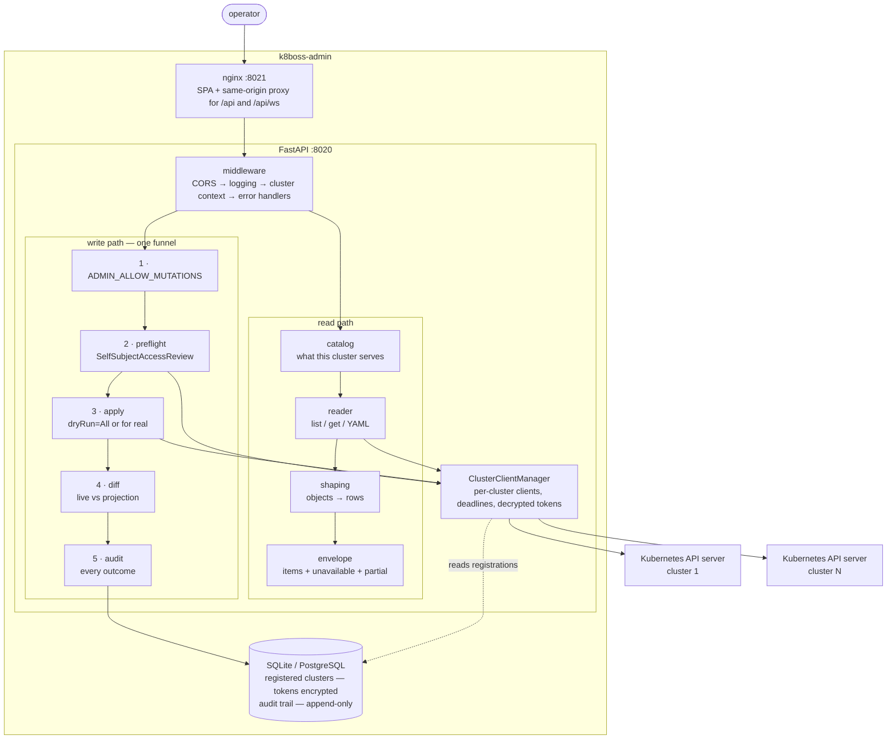

# k8boss-admin

A Kubernetes administration console. It browses every resource a cluster serves,
and it changes them through a path that checks the permission first, dry-runs the
write, shows you the diff, waits for you to confirm, and records what happened.

It is a web UI for the work you would otherwise do with `kubectl` across several
clusters, built on the assumption that the dangerous part is not reading.

## What it is not

* **Not a monitoring or observability tool.** No metrics storage, no dashboards
  over time, no alerting. It shows you the cluster's current state, live.
* **Not a deployment or CI system, with one stated exception.** It does not
  build, does not template, does not reconcile from Git. If you have GitOps,
  this console is the thing you use when you are deliberately going around it —
  which is why every write is dry-run-first and audited.

  The exception is the router: k8boss-admin ships a pinned HAProxy ingress
  controller and can install it (§14), because an exposure written into a
  cluster with no controller is an object that routes nothing while looking
  created. It installs **one bundle of eight objects, through the same write
  funnel as everything else** — no reconcile loop, no desired state, no drift
  correction, and its status is a live read like every other page. It said "and
  nothing else, ever" until §33 below; it is now one of exactly two. It is off by default behind `ADMIN_ROUTER_MANAGE_ENABLED`.
  [`docs/adr-0004-shipped-router.md`](docs/adr-0004-shipped-router.md) records
  the boundary and what it costs.

  The operator portal (§16) is a different act, not a second exception: it ships
  no catalog and installs nothing. It creates **one** OLM `Subscription` in an API
  your cluster already serves — exactly what the YAML editor could — and Operator
  Lifecycle Manager, which is your cluster's software, does the installing.
  Off by default behind `ADMIN_PORTAL_INSTALL_ENABLED`;
  [`docs/adr-0005-operator-portal.md`](docs/adr-0005-operator-portal.md) records
  why that line is where it is.

  **There is a second bundle, and it is the last one.** On a cluster that runs no
  OLM at all, §16's portal is empty and correct and useless, and §33 can install
  Operator Lifecycle Manager itself: upstream's release manifests, vendored byte
  for byte and pinned by SHA-256, applied as twenty-six ordinary writes in two
  phases. Off by default behind `ADMIN_OLM_INSTALL_ENABLED`, separate from the
  gate above because the sizes are different — that one writes into an API your
  cluster already serves, this one creates the API, along with a ClusterRole
  granting OLM every verb on every resource. ADR-0004 said one bundle, forever;
  [`docs/adr-0008-shipped-olm.md`](docs/adr-0008-shipped-olm.md) is the
  re-reading that made it two, with the argument against it kept intact.
* **Not a security posture product.** It lists NetworkPolicies, says which pods
  each one selects, and — by subtracting one listing from another — which pods
  nothing selects. That is a correlation, not an analysis: it computes no
  reachability between pods, models no attack paths, and cannot tell you whether
  a policy is *enforced*, because enforcement belongs to the CNI plugin and no
  API this console can reach reports on it. No service mesh awareness, no
  runtime process intelligence. That is K8Boss, a separate, closed-source
  product this console was split out of — not itself open source, so there is
  no public repository to link to; see
  [`docs/adr-0002-lineage.md`](docs/adr-0002-lineage.md) for what was carried
  over and what deliberately was not.
* **Not an identity authority.** Built-in authentication is optional and supports
  local accounts plus LDAP. When it is disabled, the legacy authenticating-proxy
  mode remains available and `X-K8Boss-User` is advisory.
* **Not a cache.** No cluster contents are stored. Every page is a live read, so
  it cannot show you a stale answer with a confident face — and it cannot show
  you anything when the API server is unreachable, which it will say plainly.

---

## Sixty-second quickstart

```bash
git clone https://github.com/aesaganda/k8boss-admin
cd k8boss-admin
docker compose up --build
```

Open **http://localhost:8021**. The console starts **read-only**: it can read
every cluster you register and write to none of them. That is deliberate — see
[Turning on writes](#turning-on-writes).

Then connect a cluster. There are exactly two ways, and which one you want
depends on where the cluster is — see
[**Connecting a cluster**](#connecting-a-cluster) below:

| Your cluster | What you do | What the console stores |
|---|---|---|
| **Local** — `kind`, `k3d`, minikube, Docker Desktop, Rancher Desktop, Colima, OrbStack, MicroK8s | **Nothing.** It is found in your kubeconfig and registered on first start | The context's own credential, copied and encrypted |
| **Remote** — anything else | Its API server address and a ServiceAccount token | The token, encrypted |

> **If you are running the Compose stack against a local cluster, read
> [the caveat](#if-the-console-runs-in-a-container-and-your-cluster-is-on-localhost)** —
> `kind` and `k3d` publish their API server on `127.0.0.1`, which from inside the
> backend container is the container. The console detects that, declines to
> register something that cannot connect, and tells you on the Clusters page.
> Running the console on the host (`make dev`) is the friction-free path there.

### Enable sign-in and user administration

Authentication is opt-in so existing proxy deployments keep working. For a
first local administrator, place these values in a mode-`600` Compose env file
(do not put the password in shell history):

```dotenv
AUTH_ENABLED=true
AUTH_BOOTSTRAP_USERNAME=admin
AUTH_BOOTSTRAP_PASSWORD=replace-with-a-long-random-password
AUTH_COOKIE_SECURE=false
```

Start with `docker compose --env-file .env.auth up --build`, sign in, then open
**Administration -> Users**. The bootstrap credentials are used only while the
users table is empty and never overwrite an existing account. Set
`AUTH_COOKIE_SECURE=true` behind HTTPS.

**Administration -> Identity providers** lists every sign-in method this build
supports — where each one points, which group confers the `admin` role, and
whether it is configured in the console or from the variables below — and
configures them. One provider of each kind; the variables remain as the fallback
for a kind with nothing stored, so none of this has to be used. Deleting a stored
provider gives the variables back rather than switching the provider off. See
[`docs/adr-0011-database-backed-identity-providers.md`](docs/adr-0011-database-backed-identity-providers.md).
**Administration -> Sessions** lists every session that can currently act on the
console, with the address and browser it was opened from, and revokes one. An
account being active and a session being live are different facts: deactivating
an account revokes its sessions, and a lost laptop is the case where you want
the session gone and the account left alone.

LDAP is search-and-bind: the service account finds one user DN, then the console
binds as that DN with the submitted password. Plain-text LDAP is refused; use
`ldaps://` or StartTLS. These variables are the fallback — the same values can be
typed into **Administration -> Identity providers**, which stores them (secrets
encrypted) and takes precedence from then on.

```dotenv
AUTH_ENABLED=true
LDAP_ENABLED=true
LDAP_URL=ldaps://ldap.example.com:636
LDAP_BIND_DN=cn=k8boss-admin,ou=services,dc=example,dc=com
LDAP_BIND_PASSWORD=replace-with-the-directory-service-password
LDAP_USER_SEARCH_BASE=ou=people,dc=example,dc=com
LDAP_USER_SEARCH_FILTER=(uid={username})
LDAP_USERNAME_ATTRIBUTE=uid
LDAP_DISPLAY_NAME_ATTRIBUTE=cn
LDAP_EMAIL_ATTRIBUTE=mail
LDAP_ADMIN_GROUP_DN=cn=k8boss-admins,ou=groups,dc=example,dc=com
LDAP_TLS_VALIDATE=true
```

Directory users are synchronized after their first successful login. Membership
in `LDAP_ADMIN_GROUP_DN` maps to the console `admin` role; all other directory
users map to `user`. LDAP passwords are never stored. Local accounts with the
same normalized username always take precedence and cannot be taken over by LDAP.

Role mapping applies only when the directory actually returns the membership
attribute. When it does not — an ACL that hides `memberOf` from the search
account, a disabled referral chase, a truncated entry — the account keeps the
role it already had. Writing the default there would demote a directory
administrator on any login where the attribute did not come back, and the next
good login would silently restore them.

### Enable single sign-on

Register the console as an OpenID Connect client at your issuer, with the
redirect URI `https://<your-console-host>/api/auth/oidc/callback`, then:

```bash
AUTH_ENABLED=true
OIDC_ENABLED=true
OIDC_ISSUER=https://sso.example.com/realms/platform
OIDC_CLIENT_ID=k8boss-admin
OIDC_CLIENT_SECRET=replace-with-the-registered-client-secret   # omit for a public client
OIDC_REDIRECT_URL=https://console.example.com/api/auth/oidc/callback
OIDC_SCOPES=openid profile email groups
OIDC_ADMIN_GROUP=k8boss-admins
AUTH_COOKIE_SECURE=true
```

The flow is Authorization Code with PKCE (S256). The ID token is verified against
the issuer's published keys before a single claim in it is read: signature,
issuer, audience, expiry, and a nonce bound to that browser's own sign-in
attempt.

Two things are worth getting right at setup time:

* **Ask for the groups claim explicitly.** Most issuers omit it unless the scope
  was requested *and* the client is configured to emit it. Without it the console
  cannot map roles, and it deliberately leaves existing roles alone rather than
  demoting everyone (same rule as LDAP, above).
* **Set `OIDC_REDIRECT_URL` unless you are behind exactly one ingress that
  forwards `Host` faithfully.** OAuth requires the redirect URI on the token
  exchange to be byte-identical to the one on the authorization request, and a
  rewritten host produces an `invalid_grant` that reads like a credential
  problem.

An SSO identity is bound to the issuer's `sub` claim on first login. It cannot
take over a local account with the same username, and a different `sub`
presenting an already-bound username is refused rather than merged — otherwise
anyone who can make an issuer assert a username inherits whatever that username
already had. The same binding, and the same two refusals, apply to the three
providers below.

### Enable a plain OAuth 2.0 provider

For an authorization server that is **not** an OpenID Connect provider — GitHub,
GitLab, Gitea, Bitbucket, a Keycloak client with the OIDC protocol switched off.
It issues an access token and no ID token, so identity comes from a userinfo
endpoint the console reads with that token rather than from a signature.

```bash
AUTH_ENABLED=true
OAUTH_ENABLED=true
OAUTH_AUTHORIZATION_URL=https://gitlab.example.com/oauth/authorize
OAUTH_TOKEN_URL=https://gitlab.example.com/oauth/token
OAUTH_USERINFO_URL=https://gitlab.example.com/api/v4/user
OAUTH_CLIENT_ID=replace-with-the-application-id
OAUTH_CLIENT_SECRET=replace-with-the-application-secret
OAUTH_REDIRECT_URL=https://console.example.com/api/auth/oauth/callback
OAUTH_SCOPES=read_user
OAUTH_SUBJECT_FIELD=id
OAUTH_USERNAME_FIELD=username
OAUTH_BUTTON_LABEL=GitLab
AUTH_COOKIE_SECURE=true
```

Three things are worth getting right at setup time:

* **Name the subject field.** `OAUTH_SUBJECT_FIELD` is the provider's stable
  identifier for a person, and it is what the console account is bound to.
  GitHub and GitLab both call it `id`; a bare Keycloak client still calls it
  `sub`. Point it at a field the userinfo document does not contain and every
  sign-in is refused — deliberately, because falling back to the username would
  hand the second holder of a recycled name whatever the first one had. Dotted
  paths (`data.viewer.id`) address a nested field.
* **The endpoints are configured, not discovered.** A bare OAuth 2.0 server is
  not required to publish metadata anywhere. Nothing stops you pointing the
  authorization URL at one deployment and the token URL at another, and the
  console cannot tell.
* **`OAUTH_VERIFY_TLS=false` is not an inconvenience switch on this provider.**
  With no signed assertion, the verified TLS connection to the userinfo endpoint
  is the *entire* reason to believe the identity. Use
  `OAUTH_CA_CERTIFICATE_FILE` for a private CA.

An OAuth 2.0 session cannot act as a cluster identity (ADR-0007) — see
`OPENSHIFT_ENABLED` below for the provider that can.

### Enable OpenShift sign-in

Lets operators sign in with the identity they already use for `oc login`, through
the cluster's own OAuth server. Register the console as an `OAuthClient`:

```yaml
apiVersion: oauth.openshift.io/v1
kind: OAuthClient
metadata:
  name: k8boss-admin
secret: replace-with-a-generated-secret
redirectURIs:
  - https://console.example.com/api/auth/openshift/callback
grantMethod: prompt
```

```bash
AUTH_ENABLED=true
OPENSHIFT_ENABLED=true
OPENSHIFT_API_URL=https://api.cluster.example.com:6443
OPENSHIFT_CLIENT_ID=k8boss-admin
OPENSHIFT_CLIENT_SECRET=replace-with-a-generated-secret
OPENSHIFT_REDIRECT_URL=https://console.example.com/api/auth/openshift/callback
OPENSHIFT_ADMIN_GROUP=platform-admins
AUTH_COOKIE_SECURE=true
```

`OPENSHIFT_API_URL` is the **API server**, not the web console route: the
authorization endpoint, the token endpoint and the `users/~` read are all taken
from it. A 404 at start-up almost always means this points at the console route.

Identity comes from `GET /apis/user.openshift.io/v1/users/~`, read once with the
freshly issued access token, which is then dropped. The console stores no cluster
credential and a console logout has nothing cluster-side to revoke.

Two notes on groups. OpenShift attaches `system:authenticated` and
`system:authenticated:oauth` to every OAuth login, so listing either in
`OPENSHIFT_ALLOWED_GROUPS` admits every account the cluster authenticates. They
are passed through unfiltered on purpose, because genuinely useful cluster groups
like `system:cluster-admins` cannot be kept without them.

This is the one provider besides OIDC whose sessions may act as a cluster
identity under ADR-0007, and it is the strongest case for it: the username and
groups are the cluster's own record, read from the cluster.

### Enable SAML 2.0 sign-in

For ADFS, Shibboleth, PingFederate, or an Okta/Entra application registered as
SAML rather than OIDC. Point your identity provider at
`https://<your-console-host>/api/auth/saml/acs`, or hand it
`https://<your-console-host>/api/auth/saml/metadata`, which publishes the same
thing in the form its setup form expects.

```bash
AUTH_ENABLED=true
AUTH_COOKIE_SECURE=true          # required, see below
SAML_ENABLED=true
SAML_IDP_ENTITY_ID=https://sso.example.com/idp/shibboleth
SAML_IDP_SSO_URL=https://sso.example.com/idp/profile/SAML2/Redirect/SSO
SAML_IDP_CERTIFICATE="MIID...the base64 from <ds:X509Certificate>..."
SAML_SP_ENTITY_ID=https://console.example.com/saml
SAML_ACS_URL=https://console.example.com/api/auth/saml/acs
SAML_GROUPS_ATTRIBUTE=groups
SAML_ADMIN_GROUP=k8boss-admins
```

**SAML needs HTTPS and `AUTH_COOKIE_SECURE=true`, and the button is withheld
without them.** The assertion arrives on a cross-site form POST, which carries no
`SameSite=Lax` cookie, so the handshake cookie has to be `SameSite=None` — and
every current browser discards a `SameSite=None` cookie that is not also
`Secure`. On plain HTTP the cookie never comes back and every sign-in fails at
"the sign-in did not match", which reads as a broken identity provider.

Four more things to know:

* **The certificate can be the bare base64 body** copied straight out of
  `<ds:X509Certificate>` in the IdP's metadata — no PEM wrapping needed. Several
  may be concatenated, which is what makes an IdP signing-key rotation a config
  change rather than an outage.
* **Only SP-initiated sign-on is accepted.** An unsolicited (IdP-initiated)
  response carries no `InResponseTo`, so nothing binds it to a browser, and
  accepting one means accepting an assertion anyone can replay into anyone
  else's session. Start from the console's login page, not from the IdP's
  application portal.
* **Turn assertion encryption off for this service provider.** The console holds
  no decryption key and refuses an `EncryptedAssertion` by name rather than
  falling back to reading the envelope. The assertion is still signed and still
  travels inside TLS.
* **The console does not sign its `AuthnRequest`.** An IdP configured to require
  a signed request will refuse the handshake with its own error.

A SAML session cannot act as a cluster identity (ADR-0007): a NameID is a name in
a vocabulary no API server consumes. If you need impersonation behind a SAML IdP,
put an OIDC broker (Dex, Keycloak) in front of it and configure that as the
issuer for both the console and the API server's `--oidc-issuer-url`.

## Connecting a cluster

Two paths, and the console does not blur them. A **local** cluster already has a
credential on your disk, so there is nothing to create and nothing to type. A
**remote** cluster gets a ServiceAccount token you provision for this console
and can rotate or revoke without touching anybody's laptop.

Full contract: [`docs/api-contract.md` §34](docs/api-contract.md) and
[§3](docs/api-contract.md). Why the console is allowed to read a kubeconfig at
all, and the line that keeps it from becoming a credential store:
[`docs/adr-0012-kubeconfig-onboarding.md`](docs/adr-0012-kubeconfig-onboarding.md).

### A local cluster — nothing to type

Have a cluster from `kind`, `k3d`, minikube, Docker Desktop, Rancher Desktop,
Colima, OrbStack, MicroK8s, k3s or RKE2? Start the console:

```bash
make dev          # backend on :8020, SPA on :5174
```

On first start, with **nothing registered**, the console reads your kubeconfig,
finds the one local cluster in it, and registers it — with its own credential,
copied and encrypted. Open **Clusters** and it is there, named after its context,
with **Test connection and permissions** waiting to be clicked. That button is
still the thing that establishes the cluster answers; adoption connects to
nothing.

Whether or not anything was adopted, **Clusters → Discovered on this machine**
lists every context in your kubeconfig with an **Import** button beside the ones
this console can take, and a sentence beside the ones it cannot. Or from the API:

```bash
curl -s localhost:8020/api/clusters/discovery | jq '.items[] | {context, distribution, importable, reason}'
curl -s -X POST localhost:8020/api/clusters/import \
  -H 'Content-Type: application/json' -d '{"context":"kind-dev"}'
```

**The five conditions for automatic adoption.** All of them, every time:

1. `ADMIN_AUTO_DISCOVER_LOCAL` is `true` (the default);
2. **nothing is registered yet** — it never adds to a cluster list you curated;
3. the console recognises one of the local tools above as having written the
   context **and** its API server is a loopback or private address. Both, never
   either: a context you called `kind-prod` pointing at a public endpoint is
   remote and is never adopted;
4. it has no reachability problem the console can already see (below);
5. **exactly one** context qualifies. Two local clusters adopts neither — picking
   between them is your choice, not something to decide at boot.

Anything else registers nothing and says why in the startup log. Set
`ADMIN_AUTO_DISCOVER_LOCAL=false` to require every registration to be an explicit
act; discovery and **Import** still work.

**How a local tool is recognised.** Usually by the name it writes: `kind` writes
the context `kind-dev`, `k3d` writes `k3d-dev`, and the rest name themselves.
k3s and RKE2 name nothing — every entry in `/etc/rancher/k3s/k3s.yaml` is called
`default` — so those two are recognised by **the path** their kubeconfig is read
from, which is fixed and which no other cluster can be read from. The name
`default` on its own is never enough: plenty of remote clusters use it, and
adopting one on the strength of its name is the failure condition 3 exists to
prevent.

That means the path has to still be there. A k3s kubeconfig **copied or merged
into `~/.kube/config`** — `KUBECONFIG=~/.kube/config:/etc/rancher/k3s/k3s.yaml
kubectl config view --flatten` — has no path left to read and a context called
`default`, so it is listed as remote and imported with the **Import** button
rather than adopted. Point `KUBECONFIG_PATH` at `/etc/rancher/k3s/k3s.yaml`, or
symlink to it, to get adoption back. (A renamed context is fine: the path
identifies the file, not the name in it.)

An adopted cluster is marked **Adopted automatically at startup** in its detail
panel, so the first question about a cluster you do not remember registering has
an answer.

**What it will not import, and why.** Every context in your kubeconfig is listed,
including the ones it refuses — an empty panel would mean the same thing as a
missing kubeconfig, and those are very different problems:

| The context uses | What happens | Why |
|---|---|---|
| A client certificate (kind, k3d, minikube, Docker Desktop) | Imported | Stored as `client_certificate`; the key is encrypted at rest |
| A `token` | Imported | Stored encrypted, like any other bearer token |
| An `exec` credential plugin (EKS, GKE, AKS) | **Refused**, with the reason | The console will not run a binary named by a file on its disk, and a plugin's output expires — there is nothing to store. Use the remote path below |
| A legacy `auth-provider` | **Refused** | Same: no copyable credential |
| A username and password | **Refused** | The console presents a token or a certificate; current API servers serve neither basic auth |
| Nothing at all | **Refused** | Importing it would register an anonymous connection, which half-works against a permissive cluster and becomes a permissions mystery weeks later |

#### If the console runs in a container and your cluster is on `localhost`

`kind` and `k3d` write `https://127.0.0.1:<port>` into your kubeconfig. Inside
the backend container that address is **the container**, so a registration built
from it would be created, look correct, and reach nothing.

The console detects this, **declines to adopt**, and shows the candidate with the
reason beside it on the Clusters page. Your options, in the order they are worth
trying:

1. **Run the console on the host** — `make dev`. `127.0.0.1` is then the right
   address and the cluster's certificate covers it. This is the path with no
   caveats.
2. **Give the cluster an address that is reachable from the container** and
   register it as a remote cluster. `kind get kubeconfig --internal` prints the
   Docker-network address if the backend is on the same network.
3. Rewriting the URL to `host.docker.internal` does *not* work on its own:
   `kind`'s API server presents a certificate for `127.0.0.1` and `localhost`,
   not for that name, so it fails verification instead of connecting. The console
   will not make it work by turning verification off for you.

#### If the console cannot read your kubeconfig

Under Compose the file is mounted read-only into a container running as uid
10001, and a kubeconfig is usually mode `600` owned by you. The Clusters page now
says so explicitly — *"exists but this process cannot read it (running as uid
10001)"* — rather than reporting no clusters, which used to look exactly like a
machine with no kubeconfig on it.

`chmod 644 ~/.kube/config` fixes it on a development machine and is a bad idea
anywhere else. Running the console on the host, or registering the cluster with a
ServiceAccount token, are the better answers.

### A remote cluster — API address and a ServiceAccount token

This is the path for anything you did not create on this machine, and the only
path for a cloud cluster whose kubeconfig uses an `exec` plugin. The credential
is provisioned for this console, scoped by `deploy/rbac.yaml`, and rotatable
without touching anybody's laptop.

```bash
scripts/onboard-cluster.sh --context <kubectl-context> --name <cluster-name>
```

Applies `deploy/namespace.yaml` and `deploy/rbac.yaml` to that context (and only
that context — it never touches your ambient `kubectl` current-context), mints a
ServiceAccount token, signs in to the console if it requires a session, registers
or updates the cluster, and runs the connection test — printing exactly which
baseline permissions are missing, if any. Run it with `--help` for every flag.
The steps it automates, if you want to do them by hand or understand what it is
doing:

```bash
kubectl apply -f deploy/namespace.yaml
kubectl apply -f deploy/rbac.yaml          # binds BOTH the reader and the
                                           # writer role — see that file's own
                                           # top comment before applying it
TOKEN=$(kubectl -n k8boss-admin create token k8boss-admin --duration=8760h)
APISERVER=$(kubectl config view --minify -o jsonpath='{.clusters[0].cluster.server}')
CA=$(kubectl config view --minify --raw \
      -o jsonpath='{.clusters[0].cluster.certificate-authority-data}' | base64 -d)
```

Then either paste those into **Clusters → Register** in the UI, or:

```bash
curl -X POST localhost:8020/api/clusters \
  -H 'Content-Type: application/json' \
  -d "$(jq -n --arg s "$APISERVER" --arg t "$TOKEN" --arg ca "$CA" \
        '{name:"prod-eu", platform:"kubernetes", api_server:$s,
          authentication_type:"service_account_token", token:$t,
          ca_certificate:$ca, skip_tls_verify:false}')"
```

The token is encrypted at rest and is never returned by any endpoint.

A cluster that authenticates with an **X.509 client certificate** rather than a
token is registered the same way, with `authentication_type: "client_certificate"`
and a `client_certificate` / `client_key` PEM pair instead of `token`. The
certificate is stored in the clear — it is presented on every handshake and is
not the secret half — and the key is encrypted like a token. Sending one without
the other is refused at the form: half a pair stores fine, lists fine, and dies
in the TLS handshake with an error naming neither field.

**If `AUTH_ENABLED=true`** (the default), both calls above need a console
session: sign in first and carry the cookie and CSRF token, the same handshake
the SPA does —

```bash
curl -sS -c cookies.txt -X POST localhost:8020/api/auth/login \
  -H 'Content-Type: application/json' \
  -d '{"username":"admin","password":"<console password>"}'
# {"csrfToken": "...", ...} — read it from the response and pass it back:
curl -sS -b cookies.txt -H "X-CSRF-Token: <csrfToken from above>" ...
```

`scripts/onboard-cluster.sh` does this automatically; it is the reason to prefer
it over the raw `curl` calls above for anything but understanding the shape of
the API.

**Registering, importing and de-registering are administrator-only** when the
console authenticates operators (`AUTH_ENABLED=true`). They decide which API
server this console's transport talks to; discovery is administrator-only too,
because it reports the contexts and addresses in a file on the console's own
machine.

### Check what it can actually do there

```bash
curl -X POST localhost:8020/api/clusters/1/test
```

This connects **and** preflights nineteen baseline permissions, so a
half-permissioned ServiceAccount shows up now rather than at 03:00 on the one
action you needed. A cluster that can list everything and cannot patch a
Deployment is a valid read-only registration; the point is that it says so.

### What the console never does with your kubeconfig

* It is read **twice**: when you ask for the discovery listing, and when an
  import is confirmed. Never on a request that serves a page.
* An import is a **copy**. Afterwards, editing, rotating, moving or deleting the
  kubeconfig changes nothing about the cluster registered from it — re-import to
  pick up a new credential.
* It is **parsed, never loaded**. `exec` plugins are listed as a fact about a
  context and are never executed.
* It **overwrites nothing**. Importing a context whose name is already registered
  is a `409`; the stored credential may be the one somebody is relying on.

## Turning on writes

Two independent gates, and both must be opened by someone who read this:

```bash
# 1. Let the API server allow it: uncomment the writer ClusterRoleBinding
#    at the bottom of deploy/rbac.yaml, then re-apply.
kubectl apply -f deploy/rbac.yaml

# 2. Let the console try: compose
ADMIN_ALLOW_MUTATIONS=true docker compose up
```

With only the first, every confirm returns a `403` naming the missing grant. With
only the second, the console preflights and dry-runs and refuses to confirm. Both
are diagnosable states. What is not diagnosable is a console that writes because
a default did it quietly.

---

## The safety model, in brief

Every write in this console — scale, restart, suspend, rollback, cordon, drain,
create, replace, delete — goes through one function, in this order:

```
   ADMIN_ALLOW_MUTATIONS ──▶ preflight ──▶ dry-run ──▶ diff ──▶ confirm ──▶ audit
     read-only refuses        may I?       what would    is that      write     who did
     before the cluster       names the    the API       really       actually  what, when,
     is touched               grant        server do?    my change?   happens   including
                                                                                the failures
```

* **Preflight.** A `SelfSubjectAccessReview` for the exact
  verb/group/resource/namespace/name — so a refusal names the missing permission
  instead of relaying a bare "forbidden". A review that *fails* is kept distinct
  from a clean denial: telling you that you lack a permission you actually hold
  sends you to fix the wrong system.
* **Dry-run.** `dryRun=All` on the same URL with the same body, so the projection
  comes from the API server's own admission chain — webhooks, defaulting, quota —
  not from a simulation we wrote.
* **Diff.** A unified diff with server bookkeeping normalised out of both sides,
  so a replica change is two lines rather than two lines inside two hundred. If
  nothing would change, the UI says so instead of offering a confirm button.
* **Confirm.** `applied: true` appears only when the write actually reached the
  cluster. A successful dry run returns a full projected object and
  `applied: false`.
* **Audit.** Append-only, enforced in code. Every terminal state, including the
  denials, the conflicts and the failures.

Two more, because they are the ones that matter under pressure:

* **`PUT` carries the `resourceVersion` you were looking at.** A mismatch is a
  `409` with a *fresh* diff against live, never a blind overwrite.
* **Drain plans before it acts.** Every pod is classified `evict` / `skip` /
  `blocked` and the plan is returned whether or not anything runs. Blocked pods
  stop the drain before the node is cordoned. Evictions are reported per pod —
  "drained" over three pods that did not evict is the sentence that gets a
  machine terminated with a database on it.

The full treatment, with the concrete failure each control prevents, is
[`docs/safety-model.md`](docs/safety-model.md). The reasoning behind
dry-run-first rather than optimistic-with-undo is
[`docs/adr-0001-dry-run-first.md`](docs/adr-0001-dry-run-first.md) — the short
version being that there is no undo for a deleted StatefulSet.

---

## Features

**Read**

* **Overview** — server version, node readiness, namespace and workload counts,
  pod phases, aggregate capacity versus requests. Six independent collectors: one
  failing sets its own panel to `null` and names itself, and the page still
  renders.
* **Nodes** — capacity, allocatable, actually-requested, pod count, conditions,
  taints, roles. Per-node totals are `null` (not `0`) when the pod listing fails,
  because an idle-looking node is the one someone drains.
* **Workloads** — Deployments, StatefulSets, DaemonSets, Jobs, CronJobs and
  ReplicaSets in one table, with a real `Unknown` status for controllers that
  have not reported on the current generation.
* **Pods** — with `phase_detail` for the cases where the phase lies: a `Running`
  pod whose container is in `CrashLoopBackOff` is not reported as Running.
* **A page per pod**, at `/pods/{namespace}/{name}`, with eight tabs and the
  active one in the URL so every tab is a link: **Details**, **Metrics**,
  **YAML**, **Environment**, **Logs**, **Events**, **Terminal** and **Debug**.
  Only the visible tab fetches — two of them open a websocket, and a terminal
  that connected behind an unopened tab would start an audited exec session
  nobody asked for. Three things it is careful about:
  * **Details** carries what a table has no room for — per-container ports,
    requests, limits and `lastState.terminated`, which is what turns "restarted
    14 times" into `OOMKilled`. A container that declares no resources says so
    rather than showing `cpu 0`; init containers are their own list, because a
    `Terminated` init container is a success and the same two words on an app
    container are an outage; and a condition the kubelet has said nothing about
    stays `Unknown` rather than becoming `False`.
  * **Environment** shows every variable each container will see and where it
    comes from — including the ones that are references rather than values.
    **Secret values are never shown here**, under any setting, and the kinds of
    blank stay apart: *withheld* (it is a Secret), *could not be read* (the
    ConfigMap was refused — the variable is not known to be unset), *key not
    present* (the ConfigMap was read and has no such key, so the container will
    not start), *set by the kubelet* (a `fieldRef`, computed at start and never
    stored), and an actual empty string.
  * **Metrics** reads `metrics.k8s.io` for live CPU and memory against what each
    container asked for. A cluster with no metrics-server is an ordinary fact
    stated calmly, not a red panel — and an unmeasured pod is drawn as unknown,
    never at zero, because a pod at zero cores reads as idle and idle is what
    gets something turned off.
* **Cluster status** — the health rollup OpenShift gets from `ClusterOperator`,
  rebuilt from the five things vanilla Kubernetes actually serves: leader-election
  leases in `kube-system`, aggregated APIService availability (this is where
  `metrics.k8s.io` goes when the metrics tab empties, and the only page that says
  why), CRDs that never became Established, admission webhooks joined to their
  backing endpoints, and kubelet version skew. The row it exists for is a
  `failurePolicy: Fail` webhook with nothing behind its Service: that one is
  refusing every write it intercepts, cluster-wide, and nothing else in a vanilla
  cluster puts it in front of anyone. There is deliberately **no single verdict** —
  each section can be `null` when its read was refused, and a section that could
  not be read never renders as the healthy answer. See §19.
* **Projects** — one namespace read with what governs it, the way OpenShift's
  project page shows it on vanilla objects: quota usage beside hard limits, limit
  ranges, the Pod Security level its labels declare, role bindings and a network
  policy summary. And `New project`, which is `oc new-project` for vanilla
  Kubernetes: a namespace created together with a quota, a limit range, a
  binding and, if asked, network isolation — five ordinary writes through the
  funnel, each with its own diff and audit row. See §17.
* **Access review — what can this subject actually do** — ask the API server
  itself whether a named user or ServiceAccount may act, instead of subtracting
  role bindings and hoping. It runs the whole authorization chain, so it sees
  webhook and node authorizers that reading RBAC cannot, and it takes no action
  as the subject — which is why this exists while per-user impersonation stays a
  proposal (ADR-0007). For a user the answer is stated as conditional on the
  groups you name, because nothing on a cluster reports a person's real group
  memberships and an answer that hid that would be wrong about an administrator.
  See §23.
* **Volume snapshots, without calling one a backup** — take a snapshot of a
  claim before the risky thing, and the dialog says what you are actually
  getting: a point-in-time reference held inside the same storage system as the
  volume, captured as if the power were cut, and destroyed later by deleting the
  object if its class says `deletionPolicy: Delete`. The table's Ready column is
  the API's own three-valued `readyToUse` — a snapshot still being taken is an
  em dash, not a tick and not a cross. See §22.
* **Autoscalers that say whether they are autoscaling** — an HPA whose
  `ScalingActive` condition is false is not scaling anything, usually because the
  metric it needs cannot be read, and it looks entirely ordinary in
  `kubectl get hpa`. The table says so, every metric's current reading sits
  beside its target (an em dash when there is no reading — never 0%, which reads
  as an idle workload), and the bounds go through the funnel: lowering a ceiling
  below the running replica count is named as the scale-down it is, with the
  number of pods that stop. Scaling a workload an autoscaler owns now says which
  autoscaler will put the count back. See §21.
* **Pod Security, set with the pods that would break** — change a namespace's
  admission level and the preview carries the API server's own warnings naming
  the pods already running that do not meet it, because Pod Security admission
  returns them on a `dryRun=All` update exactly as on a real one. Nothing is
  evicted by the change and the dialog says so before you confirm. See §18.
* **Expand a claim, with what a green result does not prove** — a
  PersistentVolumeClaim that filled up, grown through the funnel: the preview
  refuses a shrink by arithmetic before anything is sent, names the StorageClass
  if it forbids expansion, and lists the pods that have the volume mounted. The
  write changes what the claim *asks for*; the volume grows when the storage
  provider grows it and the filesystem after that — often not until every pod
  using it restarts. `applied: true` says the request changed, the response
  carries the capacity it did not change, and both are on screen side by side.
  See §20.
* **Namespaces, Events, Network, Config, Storage, Access** — Services, Ingresses,
  ConfigMaps, Secrets (key names and byte lengths only), PVCs, PVs,
  StorageClasses, ServiceAccounts, Roles and Bindings.
* **Network policies** — the declared rules, spelled out as sentences rather than
  echoed as YAML, because the YAML is what people misread. A direction nobody
  governs never renders as a denial (`policyTypes: [Ingress]` with no egress
  section restricts nothing; add `Egress` to that list and it blocks everything),
  a rule that names neither peer nor port is reported as opening the direction
  outright, and a bare `podSelector` peer is described as *pods in this
  namespace* — which is the single most common misreading of the API.
* **Pod isolation** — the inverse listing: every pod, and which policies select
  it. Reading the policy list tells you what you wrote; this tells you what you
  missed, and a pod nothing selects — unrestricted, because Kubernetes defaults
  to allow — appears on no policy's page. A pod whose selectors could not be
  evaluated is an em dash, never "unrestricted".

  Neither view claims a policy is *enforced*. NetworkPolicy is implemented by the
  CNI plugin, no API here reports whether this cluster's implements it, and a
  cluster whose plugin does not will serve these objects while forwarding every
  packet they describe as denied. Both tabs say so above the table.
* **Resource explorer** — anything the cluster serves, including CRDs, through
  the dynamic client, with the raw object and a YAML view.
* **Logs and exec** — pod logs over HTTP or a WebSocket that always terminates
  with exactly one `end` or `error` frame, so you can tell "the pod stopped
  logging" from "we lost the connection"; and a terminal, gated on both write
  gates and audited on open and close. Neither picks a container for you on a
  multi-container pod: the logs of the wrong container look exactly like the
  logs of the right one.
* **Node debug pods** — `kubectl debug node/…` from a node's page, for when the
  machine is what needs looking at and there is no SSH to it. Off by default
  behind its own gate; the host filesystem mounts **read-only** unless you ask
  otherwise (unlike `kubectl`); the whole manifest is the diff you confirm; and
  because nothing removes it afterwards — `kubectl debug` has no `--rm` either —
  the console labels what it creates, lists it per node, and offers a Remove.
* **Debug containers** — `kubectl debug` for the pod whose image has no shell.
  Attaches an ephemeral container carrying the tools, then opens a terminal in
  it. A write like any other: previewed as a diff, confirmed, audited with the
  image named. A cluster that does not serve `pods/ephemeralcontainers` is told
  so as an ordinary fact, and a cluster whose discovery could not be read is
  reported as *unknown* rather than as unsupported.

**Write** (all dry-run-first, all audited)

* Scale, restart (the `kubectl rollout restart` mechanism), suspend/resume
  Jobs and CronJobs.
* Rollout history and rollback — ReplicaSets for Deployments, ControllerRevisions
  for StatefulSets and DaemonSets. A kind with no revision concept says so rather
  than returning an empty list.
* Cordon, uncordon and drain.
* **Approve a certificate request, after reading what it asks for** — the
  approve button with the least on screen anywhere in Kubernetes.
  `kubectl get csr` shows who *asked*; it does not show what they asked to
  **become**, and those are different fields. So the console decodes the PKCS#10
  in `spec.request` and puts the common name, the organizations and the SANs in
  front of you: a request from an ordinary user whose organization is
  `system:masters` is a cluster-admin credential the API server honours ahead of
  RBAC — no Role bounds it, no binding revokes it, and only rotating the signing
  CA takes it back — and everywhere else it looks like a kubelet renewal. A
  request nobody could decode says the subject is *unknown*, never empty.
  `Approved` and `Issued` are two states, because approving records a condition
  and a signer still has to act — for a signerName nothing on the cluster signs,
  a request sits Approved with no certificate forever. And the decision is final:
  the API server refuses to rewrite one, so a settled request is offered no
  second decision rather than a button that always fails. See §25.
* **A node's taints and labels, with the pods a taint deletes** — `NoSchedule`
  and `PreferNoSchedule` steer where new work is placed and move nothing;
  `NoExecute` removes the pods already running that do not tolerate it, and the
  three are three entries in one dropdown. So the preview names those pods
  before the confirming call, says which go at once and which carry a
  `tolerationSeconds` and go later — a node that looks fine for five minutes and
  then empties — and states the thing this console had otherwise taught the
  opposite of: **that removal is a delete, not an eviction, so a
  PodDisruptionBudget does not refuse it**, unlike drain. A pod listing that
  failed makes the deletion list `null` rather than empty, and the operator has
  to acknowledge by name that the console cannot say what the button does.
  Labels get the mirror-image preview: nothing is evicted by a label change,
  because node affinity is `requiredDuringSchedulingIgnoredDuringExecution` —
  what changes is where those pods can go *next*, so the pods placed here by a
  rule naming a key you are removing are listed as exactly that. See §24.
* **Delete a namespace, having been shown what goes with it** — the one delete
  whose own diff shows the wrong object. `kubectl delete namespace prod` prints
  one line; §4's preview shows the namespace object's YAML disappearing, and
  nothing on that screen is the database, the address or the admission webhook
  that goes too. So this one reads them first: every namespaced kind the cluster
  serves, listed live from discovery rather than from a curated list that goes
  stale the first time somebody installs a CRD — and a kind whose listing was
  refused is an em dash, never a `0`, because *"this namespace holds no
  PersistentVolumeClaims"* is the sentence that ends with a deleted disk. Each
  bound claim's volume is read for its reclaim policy: `Delete` destroys the
  data and `Retain` keeps it as a `Released` volume, they are opposite outcomes
  behind one button, and a volume the console could not read is reported as
  **unknown** rather than as either. LoadBalancer Services are named with the
  addresses that stop answering, and admission webhooks backed from inside the
  namespace are named too — a cluster-scoped `failurePolicy: Fail` webhook that
  loses its backend refuses every write it intercepts, cluster-wide. Every
  object holding a finalizer is listed, because a namespace stuck in
  `Terminating` is the usual complaint and this is why; the same plan run
  against one already stuck is the diagnosis. You acknowledge each finding by
  name and type the namespace's name, and `applied: true` means a
  `deletionTimestamp` — not that the namespace is gone. See §26.
* **Act as the signed-in operator, per cluster** — the one thing this console
  could not do, documented as a gap in `docs/adr-0007-impersonation.md` before it
  was closed. Every other call is made as one ServiceAccount per cluster, which
  means the permission check answers about the *console* and the audit trail's
  actor is a name only this application can vouch for. A cluster registered with
  **act as the signed-in operator** sends `Impersonate-User` instead, so the API
  server checks permissions, runs admission and writes **its own audit log** as
  the person using the console — and "who scaled the payments service to zero"
  becomes answerable by someone who does not trust this console at all. Disabled
  buttons finally say *whose* permission is missing. Off by default and
  per-cluster, because the grant it needs is cluster-admin by proxy unless it
  carries `resourceNames` — so `deploy/rbac.yaml` ships that rule written out and
  commented out. Single sign-on sessions only: if this console's own password
  table could make a request arrive as `alice`, that table has become an identity
  provider your cluster trusts. And it **refuses rather than falling back** — a
  read served as the console would show an operator data their own RBAC forbids,
  which is a wrong answer with a security consequence attached. See §27.
* **What a PodDisruptionBudget actually covers** — the object whose failure
  mode is silence. A budget one label key away from the workload it was written
  for covers nothing: the YAML is indistinguishable from one guarding a
  production database, `kubectl describe` prints the same fields, and a team
  believes it has availability protection it does not have. So the page counts
  coverage from a live pod listing — `0 pods` is the finding, and a listing that
  did not answer is an em dash, never a zero, because that zero gets a *working*
  budget deleted as dead. It separates **can never allow an eviction**
  (`maxUnavailable: 0`, or `minAvailable` at the pod count — arithmetic, which no
  amount of waiting fixes) from **is not allowing one right now**, which usually
  clears on its own. And it names the failure no single budget can: Kubernetes
  refuses the eviction **outright** for a pod covered by two budgets, whatever
  either budget's `disruptionsAllowed` says — so both objects look perfectly
  healthy while a drain over them cannot finish, and this is the only screen
  where either mentions the other. Nothing here claims a budget is *enforced*:
  the eviction API is the enforcer. See §28.
* **Whether the next workload will be admitted, and which limit refuses it** —
  a ResourceQuota refuses at admission, and the refusal is a 403 somebody parses
  under pressure. Everything needed to answer first is already in the namespace,
  so the project page does the arithmetic: type what the workload asks for and
  it says whether it fits, how much room is left, and *which* of a quota's
  bounds is the tight one — none of which a 403 carries. It separates that from
  the refusal that is not about headroom at all: **a quota bounding a compute
  resource makes it compulsory**, so a container omitting `requests.cpu` where
  some quota bounds it is refused with *"must specify requests.cpu"* with the
  quota one percent used — and the fix is a LimitRange, an object the message
  never names. `unknown` is a real verdict, drawn as one: an unwritten
  `status.used` is not zero, and a scoped quota's applicability to a pod that
  does not exist yet is not guessed. The API server still admits — §4's dry run
  is what asks it. See §29.
* **Granting and revoking a role, with what the role actually confers on screen** —
  a `roleRef` is a name. §4's editor can already write the binding, and its diff
  is a name appearing in a list; what that name can now *do* is in a different
  object nobody opened. So the grant dialog resolves the role first and calls out
  five capabilities: a wildcard, `create rolebindings` (the grantee can now grant
  themselves and anyone else everything else bindable here), `create pods/exec`
  (**a shell in a pod reads every Secret mounted into it, so `edit` hands over
  the namespace's credentials without having a rule about Secrets at all**),
  `impersonate`, and direct Secret reads. A role this console could not read is
  **unknown**, never "grants nothing" — and a role that does not exist is its own
  state, because the API server accepts a binding to it and it starts granting
  the moment somebody creates that name. On a revoke it lists what *else* names
  the subject, including cluster-wide bindings, so `applied: true` is never read
  as "revoked"; when that listing is refused it says so rather than reporting an
  empty result. See §30.
* **Why is this pod Pending** — the console used to answer that with the word
  `Pending`. The real answer exists: the scheduler computed it over its whole
  predicate chain and wrote it into an event three clicks away in a list nobody
  filters. The pod's **Scheduling** tab splits the question first — a Pending pod
  that already has a node has been *placed*, and what is holding it is an image
  or a volume on that machine, not cluster capacity — then quotes the
  scheduler's message verbatim **with the age of the attempt behind it**, because
  it is a snapshot and a node added since does not rewrite it. A missing message
  is drawn as *"no explanation is readable"*, since events age out of etcd within
  the hour and a blank there reads as nothing being wrong. The node table only
  ever **rules a node out**: there is no "fits", because the scheduler weighs
  affinity, topology spread, volume zone and every plugin the cluster runs, and
  a console that promoted its own shrug would send you to argue with a scheduler
  that had already said no. See §31.
* **The certificate behind each exposure** — `kubectl get ingress` prints
  `TLS: 1 secret`; it does not print a date and it does not print a name, and
  those are the two facts that decide whether the site is up tomorrow. The
  Routes page decodes what each Route, Ingress and Gateway listener actually
  points at and reports the expiry **and** whether the certificate's subject
  alternative names cover the hostname it serves — because a certificate can be
  freshly issued, correctly signed and for a host you moved off last month,
  which is a green row in every Kubernetes tool there is and a browser that
  refuses to connect. An Ingress with two `spec.tls[]` blocks gets two rows, not
  one summarised into the first. A Secret it could not read is **unknown**, never
  an exposure with no certificate. A passthrough exposure and one served by the
  router's default are drawn as what they are rather than as faults. It verifies
  nothing — no chain, no revocation, no handshake — and says so above the table
  rather than under it. Only `tls.crt`, only from `kubernetes.io/tls` Secrets,
  and no PEM ever reaches the browser. See §32.
* **`Create <Kind>…` on every listing, including your CRDs.** Every resource
  table in the console — the typed pages, the browsable tabs, the Custom
  Resources page and the API explorer — carries a create button for the kind
  that listing holds, and all of them open the same dialog and post the same
  YAML to the same endpoint. The kind is read from the cluster's own discovery,
  never from the tab's title, so the button never offers a kind that does not
  exist.
* **Starter manifests, not an empty editor.** Opening `Create Service…` seeds a
  valid minimal Service; kinds whose shapes really differ get more than one
  starter to pick between, and picking another one is confirmed once you have
  typed something. Every starter carrying a pod template applies under the
  restricted Pod Security Standard, so the first click is a diff and not an
  admission rejection. For a kind this console has never heard of — yours — the
  seed is a labelled skeleton of `apiVersion`, `kind` and a name: guessing at
  your CRD's schema would be a wrong answer with a Create button under it.
* **A button you cannot use is disabled with the reason, and the reason is the
  true one.** "This cluster does not serve a create for this resource" (its
  discovery says so), "the console's ServiceAccount may not create these" (the
  preflight says so), "we could not establish whether you may" (the review
  itself failed) and "this deployment is read-only" are four different
  sentences, and the console will not print one of them for another: the second
  sends you to a ClusterRole, the fourth to an environment variable, and the
  first nowhere at all.
* Create, edit and delete NetworkPolicies, from a default-deny starter — the
  same funnel and the same starter mechanism as every other kind, so the diff
  is shown before a segmentation change reaches a cluster.
* Create, replace and delete any resource from YAML, with optimistic
  concurrency. The manifest editor numbers its lines and colours its syntax, so
  the line a parse error names is the line you can see. One document per create:
  a paste holding four objects is refused rather than split, because a create
  that lands three of them and fails the fourth has no honest way to report
  itself.
* **One reading of your manifest, and the editor tells you where it is not the
  obvious one.** The console reads a document the way it sends it: an unquoted
  `off` is the boolean `false`, `0755` is 493, `8:30` is 510 and `y` is `true` —
  YAML 1.1, which is also what `kubectl` sends for three of those four. YAML 1.2,
  which is what your editor almost certainly shows you, reads every one of them
  differently, so each is named by path with both readings as a warning that does
  not block, while quoting it is still free. It is found by parsing the document both ways rather
  than by pattern-matching the text, so an `off` inside a `|` block is what it
  is: part of your config file, and not a warning.
  [`docs/adr-0009-one-yaml-reading.md`](docs/adr-0009-one-yaml-reading.md) has
  the measurements, and
  [`docs/adr-0010-single-letter-booleans.md`](docs/adr-0010-single-letter-booleans.md)
  closed the last difference the warning could not see. Seven scalars still reach
  a cluster differently from here than from `kubectl`, and the editor names every
  one of them.
* **A form view on every create dialog, modelled for the kinds that have one** —
  OpenShift's "Configure via: Form view / YAML view", with the same difference
  the Routes screen below draws. The document is the source of truth and the
  form is a projection of it, so an `affinity` block or an annotation you
  hand-wrote survives a trip through the form; and rather than warning that
  *some fields may not be represented*, the form lists the ones it is not
  showing, by path. On a kind with no model the control is still there and
  disabled, saying which kinds have one: a hidden control would make "no form
  for this kind" and "no forms in this console" look identical.
* Every object's YAML, rendered the same way, wherever the object is — including
  a pod's, from the row you clicked. Each panel says when it was read, re-reads
  on a timer, and has a Reload button for when a timer is not fast enough. A
  refresh that fails keeps the manifest and says the refresh failed rather than
  presenting an older copy as current, and an object that changes while it is
  open in the editor raises a warning instead of quietly rewriting the edit.

**Operational**

* Multiple clusters, credentials encrypted at rest, per-cluster connection
  testing with a permission report.
* **Nothing to type for a local cluster (§34).** `kind`, `k3d`, minikube,
  Docker Desktop and the rest are found in the kubeconfig and registered on
  first start, with their own credential copied and encrypted — including the
  X.509 client certificates those tools write, which no amount of "paste a
  bearer token" could have accepted. **Clusters → Discovered on this machine**
  lists every context with an Import button beside the ones it can take and the
  reason beside the ones it cannot: a credential plugin is a fact about a
  context, never something this console runs. The kubeconfig is read twice — to
  list, and to copy — and never again, so nothing here is a live credential
  source. [`docs/adr-0012-kubeconfig-onboarding.md`](docs/adr-0012-kubeconfig-onboarding.md).
* An append-only, hash-chained audit trail with a queryable API, an integrity
  check (`GET /api/audit/verify`) and an export (`GET /api/audit/export`, NDJSON
  or CSV). It records console sign-ins and sign-outs alongside cluster writes,
  including the ones that were refused.
* Read-only mode as the default posture, reported on `/api/health` so the UI
  disables write affordances rather than offering them and failing.
* Resizable table columns on every list page: drag a column's trailing edge in
  the header, or focus the handle and use the arrow keys. Widths are remembered
  per table in the browser, so a column widened to read an image digest is still
  that wide after the next poll and the next visit. `Home`, a double-click, or
  the **Reset column widths** link puts them back.
* A **Filter** menu on every list table whose columns declare one — pod status,
  workload status, node readiness and roles, namespace phase, service type,
  volume status. Checkboxes, several at once, each with the number of rows it
  would leave. A value the console knows about is listed even when nothing is in
  it ("Pending 0" is an answer), a value only the cluster knows about is added
  from the rows themselves, and the counts are stated as counts of the rows the
  page has loaded rather than as cluster totals. What is filtered is shown as
  chips beside the menu, with "Showing 3 of 76" next to them; filters are not
  remembered between visits, on purpose.
* **Manage columns** on the same tables: choose which columns to show, keep the
  choice per table in the browser, and restore the defaults in one click. The
  name column cannot be turned off. Hiding a column hides a column — no row is
  filtered and nothing stops being read from the cluster.
* A **Comfy / Compact** row density on the workload and pod tables, in the
  toolbar above each. Comfy is the default and lets a long name, status reason
  or image list wrap; Compact holds every row to one line and tightens the
  spacing, which is around four times as many rows on screen for a namespace
  full of generated names. It changes no column widths — a clipped value ends
  in an ellipsis, keeps its tooltip, and is one drag or one click away from
  being readable again. The choice is remembered in the browser and shared by
  both tables.

---

### Creating an object, wherever you are looking at one

Every listing creates its own kind. There is one dialog behind all of them and
one endpoint behind that — the same `POST` the masthead's `+` has always used —
so there is no second write path to drift, and a create is preflighted,
dry-run, diffed, confirmed and audited exactly like an edit. What each listing
adds is the kind and a starter for it, both read from the cluster's own
discovery rather than from anything written down here.

**This is not a template engine.** Starters live in the browser, are seeds
rather than stored state, and nothing reconciles what you create afterwards.
Editing a starter and creating twice creates two unrelated objects, which is
what `kubectl apply` of a file you edited does too. `docs/adr-0006-projects.md`
draws the same line from the other side.

### Routes — exposing a Service to the outside world

One page for every way a cluster is reachable from outside, whichever API it is
written in: OpenShift `Route`, `Ingress`, or Gateway API `HTTPRoute`. The
configuration screen has a **form and a YAML view**, like OpenShift's console —
with one difference that matters.

**The document is the source of truth and the form is a projection of it.**
OpenShift's console warns you that switching views discards your changes; this
one does not need the warning. Form edits are patched *into* the current
document rather than regenerating it, so a `spec.rules[1]` you hand-wrote or a
controller annotation you added survives a trip through the form — and the form
tells you, by path, which parts of the document it is not showing you. Once you
edit the YAML by hand the form locks and the write sends your document verbatim,
with no form model at all.

**The hostname and the target Service are picked, not typed.** Set an **App
domain** on the cluster — its wildcard DNS, `apps.example.com` — and naming an
exposure fills the hostname in as `<name>-<namespace>.<domain>`, OpenShift's own
rule. On OpenShift the domain is read from the cluster and offered; elsewhere you
type it once, on the registration. Any keystroke in the hostname field takes it
over for good, with a link back to the generated one, and editing an existing
exposure never rewrites the hostname it is already admitted under.

With **no** app domain set the console generates nothing and asks you to type a
hostname, which is the point rather than a gap: a name under a wildcard that does
not resolve is an exposure that is created, reports Admitted and routes nothing.
The namespace is in the generated name because without it the same Service name
in two namespaces produces one hostname twice, and the second exposure quietly
loses.

The target Service is a list of what is actually in the namespace, and a
single-port Service fills its port in too. If that listing *fails* the control
falls back to a text box and says so — an empty dropdown would read as "this
namespace has no Services" and send you to create one you already have.

**A backend that cannot express what you asked for says so and refuses to guess.**
An Ingress cannot do passthrough TLS. The console does not emit an
`nginx.ingress.kubernetes.io` annotation and hope it is nginx you are running,
and it does not quietly downgrade to edge and let you find out when your mTLS
client breaks. It tells you what happens to your traffic, what to do instead,
and refuses the write until you tick the box — the same shape as `force` on a
node drain.

**Three states, not two.** A route kind this cluster does not serve is an
ordinary fact in a neutral notice. A route kind the console could not *check* is
a warning that says it is not the same thing — because creating an exposure that
already exists claims a hostname twice.

`Admitted` is tri-state and `Unknown` is the common value: a router that has not
reported has not rejected anything, and the Ingress API has no admission
condition at all.

### The shipped router

k8boss-admin ships a pinned HAProxy ingress controller (3.2.13) and can install
it, upgrade it and remove it — eight objects, each through the same preflight,
dry run, diff and audit row as every other write. Off by default behind
`ADMIN_ROUTER_MANAGE_ENABLED`; the install plan is readable with it off, because
deciding whether to turn it on requires reading what it would create. The same
bundle is checked in as `deploy/router.yaml` for `kubectl apply`, generated by
`make router-manifest` and kept honest by a test.

It says what it does **not** serve, before you write something it will never
accept: the HAProxy controller implements Gateway API for TCPRoute only — never
HTTPRoute — and OpenShift Routes are served by OpenShift's own router.

### The operator portal

What **your** cluster's catalogs offer, and what somebody already subscribed to.
k8boss-admin ships no catalog and curates no list: every package comes from a
`CatalogSource` the cluster already runs, so a private mirror shows its own
contents with nothing to configure, and a cluster without OLM says so in a calm
notice rather than an error.

Subscribing writes **one object** — an OLM `Subscription` — through the same
preflight, dry run, diff and audit row as every other write. Off by default
behind `ADMIN_PORTAL_INSTALL_ENABLED`; the plan is readable with it off, because
deciding whether to turn it on requires reading what it would create.

**A Subscription is not an installation, and the console will not say it is.**
Creating one means one object exists; Operator Lifecycle Manager does the
installing afterwards, on its own schedule, and only if the namespace and the
approval strategy let it. Three things stop it and all three are checked before
the write — a namespace with no OperatorGroup or with two, an install mode the
operator does not support, and a `Manual` approval strategy that holds the
install until somebody approves the InstallPlan. Each is a named consequence you
have to acknowledge by code before the write is accepted, the same shape as
`force` on a drain.

`Installed` is tri-state: a catalog row whose Subscription listing failed is
`Unknown`, never "not installed" — which is how you would end up subscribing
twice to an operator you already run.

### Projects — a namespace and what governs it

`oc new-project` on OpenShift hands a team a namespace that is already bounded,
already survivable, already governed and already theirs. `kubectl create
namespace` hands them a namespace, and the quota arrives after the first noisy
neighbour. The **Namespaces** page's `New project` is the OpenShift act on
vanilla objects: a Namespace with its Pod Security labels, a ResourceQuota, a
LimitRange, a RoleBinding to `admin`/`edit`/`view` for the subject you name and,
optionally, an `allow-same-namespace` NetworkPolicy — five ordinary creates
through the same preflight, dry run, diff and audit row as every other write,
each reported on its own. No template is stored anywhere; the form is the
template, and nothing reconciles afterwards.
[`docs/adr-0006-projects.md`](docs/adr-0006-projects.md) records why that is not
a second shipped bundle.

Two things the dialog is honest about that `kubectl apply` is not. The API
server cannot project a create into a namespace that does not exist yet, so on
the preview only the Namespace carries the API server's own diff; the four
objects inside it are shown as the console's rendering, labelled as such, each
with a preflight of the grant the real write will need. And every quiet failure
is a consequence you acknowledge by name before the write is accepted: a quota
with no LimitRange behind it refuses every pod that does not state its own
requests, an enforced Pod Security level accepts a violating Deployment and
never gives it a pod, and a namespace with no quota is what vanilla gives you by
default. The console never adopts an existing namespace — a name that exists is
refused before anything is written — and a partial create is reported as partial,
with nothing rolled back.

The namespace's own page (click its name) is the read half: every section is a
tri-state, so a listing that was refused is a failure panel rather than an empty
one, a quota's `used` is an em dash until the controller has written it, and a
namespace declaring no Pod Security label is reported as declaring nothing —
never as `privileged`, because the cluster default lives in a file no API serves.

### Setting the Pod Security level, and seeing what it breaks first

`Set level…` on that page is six labels and one merge patch through the funnel,
and §4's YAML editor could already write them. What it could not do is answer
the question you have first.

Pod Security admission evaluates the pods **already running** in a namespace
when its labels change, and returns what it finds as `Warning:` headers — on a
`dryRun=All` update exactly as on a real one. So the preview of "enforce
restricted" comes back carrying the API server's own list of the workloads in
that namespace that do not meet it, by name and by the field that fails, before
anything is confirmed. The console renders it verbatim and blocks Confirm until
you have ticked that you read it; it does not parse that list into a table,
because a summary of somebody else's admission decision is a summary that can be
wrong about which pods are affected.

The sentence the dialog will not let you skip is that **nothing is evicted**.
Admission runs when a pod is created. Raising the level stops nothing that is
running: a workload whose pods violate it keeps them and fails to make more, so
it stays Available until something replaces a pod and then sits below its
replica count with a `FailedCreate` event and no pod to look at. Removing a
label is not the same as setting `privileged` either — it hands the namespace
back to a cluster default that lives in a file no API serves, and the console
says it cannot tell you what that is rather than guessing.

## Architecture



No cluster contents pass through that database. Registered clusters and the audit
trail are the only things it holds. Details, including the request lifecycle and
the module map, are in [`docs/architecture.md`](docs/architecture.md).

---

## Configuration

All backend settings are environment variables with safe defaults, where "safe"
means read-only.

### Backend

| Variable | Default | What it does |
|---|---|---|
| `ADMIN_ALLOW_MUTATIONS` | `false` | **The write gate.** False makes every write return `403 mutations_disabled` before the cluster is touched, and `/api/health` report `mutations: disabled` so the UI disables the buttons. Dry-run stays available: previewing is a read |
| `SECRET_REVEAL_ENABLED` | `false` | Lets the single-object Secret read return values when asked with `?reveal=true`. Separate gate, separate blast radius; every reveal is audited either way |
| `ADMIN_DEBUG_IMAGE` | `busybox:1.36` | The image a debug container is attached with when the operator names none. Not a gate — attaching one needs `ADMIN_ALLOW_MUTATIONS` and `patch pods/ephemeralcontainers` — but worth setting for an air-gapped cluster, which cannot pull from Docker Hub and answers the attempt with an `ImagePullBackOff` on a pod somebody is already debugging |
| `ADMIN_NODE_DEBUG_ENABLED` | `false` | **A third gate, and the one to read about before flipping.** Allows a node debug pod: a pod pinned to one node with the host filesystem mounted and the host PID namespace shared. A shell in one is effectively root on that machine — it reaches every pod's ServiceAccount token and mounted Secrets on that node. Separate from `ADMIN_ALLOW_MUTATIONS` because RBAC cannot express the difference between this pod and any other, so this switch is the only control the console itself has. With it off, the create *and its dry run* are refused, and the refusal is audited |
| `ADMIN_NODE_DEBUG_NAMESPACE` | `default` | Namespace node debug pods are created in. The namespace decides which Pod Security level admits them: a cluster enforcing `restricted` everywhere needs one namespace labelled to permit host namespaces and hostPath, and pinning the console to it keeps that exception in one auditable place |
| `ADMIN_ROUTER_MANAGE_ENABLED` | `false` | **A fourth gate.** Allows the console to install, upgrade and remove the HAProxy ingress controller it ships (§14). Separate from `ADMIN_ALLOW_MUTATIONS` because of what an install creates: a cluster-scoped ClusterRole that can read every Secret in the cluster — which is what any ingress controller needs to terminate TLS, and which RBAC cannot narrow — plus a process on the cluster's ingress path. Unlike node debug pods, the **dry run is permitted with this off**: the manifests are a pinned copy of a public upstream bundle rather than a recipe for a privileged pod, and deciding whether to turn this on requires reading them |
| `ADMIN_ROUTER_NAMESPACE` | `k8boss-router` | Default namespace the shipped router is installed into, and where status looks when there is no installation to discover it from. Only a default: the namespace a running router actually lives in is read back off its own ClusterRoleBinding, so changing this does not make the console lose track of one already installed |
| `ADMIN_CLI_ENABLED` | `false` | **A fifth gate.** Allows a CLI session: a pod carrying `kubectl` (or `oc`) that the console opens a shell into, for the one command it has no page for. Separate from `ADMIN_ALLOW_MUTATIONS` because of what it removes rather than what it creates — every command typed in that shell is outside the write funnel, so there is no preflight naming the permission, no dry run, no diff, and **no audit record of what changed**. The trail records that a session was opened, by whom and for how long; it cannot record the `kubectl delete` typed into it. With this off, the create *and its dry run* are refused, and the refusal is audited |
| `ADMIN_CLI_SERVICE_ACCOUNT` | `default` | **The identity every kubectl command in that pod runs as, and the only control over what it can reach.** Not the console's permissions and not the signed-in operator's. Kubernetes has no RBAC verb covering which ServiceAccount a pod may bind, so a caller who can create a pod here can bind an account more privileged than themselves and nothing downstream narrows it — which is why this is a deployment setting rather than a per-user one. The default is the namespace's own `default` account, which holds no permissions: kubectl in the pod is refused by the API server for everything until a cluster admin deliberately binds a Role. Bind the narrowest Role that makes the sessions useful, and read `docs/safety-model.md` §9.2 before widening it |
| `ADMIN_CLI_NAMESPACE` | `default` | Namespace CLI pods are created in, and where `ADMIN_CLI_SERVICE_ACCOUNT` is looked for. It decides both which Pod Security level admits the pod and which accounts are bindable to it, so pinning the console to one namespace keeps both in a place an administrator chose |
| `ADMIN_CLI_IMAGE` | `alpine/k8s:1.34.9` | Image a CLI pod runs. It needs `kubectl` (or `oc`) on its PATH **and a `/bin/sh`** — the pod runs a shell loop, because a kubectl image's own entrypoint *is* kubectl and would exit immediately. The console cannot check either and does not pretend to: an image without them starts fine and answers `command not found`. Pick a kubectl within one minor version of your cluster — Kubernetes' own supported skew, which this default will drift out of. Set an image carrying `oc` for OpenShift, and one in your own registry for an air-gapped cluster, where the default cannot be pulled |
| `ADMIN_CLI_MAX_SECONDS` | `3600` | Wall-clock limit on a CLI pod's container, as `spec.activeDeadlineSeconds`; 0 means unbounded. It bounds the window in which an unattended shell holding a live API token is possible. It does **not** clean up: the kubelet stops the container at the deadline and marks the pod Failed, and the pod object stays until somebody removes it |
| `ADMIN_PORTAL_INSTALL_ENABLED` | `false` | **A sixth gate.** Allows the operator portal (§16) to create an OLM `Subscription` — the one write it makes. Separate from `ADMIN_ALLOW_MUTATIONS` because of what follows the write rather than what is in it: the object is nine lines, and Operator Lifecycle Manager then installs somebody else's operator and grants it whatever its bundle asks for — with OLM's permissions, not the console's, so neither RBAC here nor any preflight bounds it. Like the router and unlike node debug pods, the **dry run is permitted with this off**: the plan is your own request rendered as a Subscription plus the contents of a catalog your cluster already publishes, and deciding whether to turn this on requires reading it. With it off, a real write returns `403 mutations_disabled` and the refusal is audited |
| `ADMIN_OLM_INSTALL_ENABLED` | `false` | **A seventh gate.** Allows the console to install Operator Lifecycle Manager itself (§33) onto a cluster that does not run it — the second and last bundle it ships. Separate from the gate above because they are different sizes of decision: that one writes one nine-line object into an API your cluster already serves, and this one *creates* that API — eight CustomResourceDefinitions, two controllers, and `system:controller:operator-lifecycle-manager`, which grants every verb on every resource in every API group including `escalate` and `bind`. That is the widest grant this console can create anywhere, and it is inherent to OLM rather than chosen here. Like the router and unlike node debug pods, the **dry run is permitted with this off** — and here that is the whole point: deciding whether to turn this on means reading that ClusterRole, so the plan renders with both gates shut. Note that opening this switch is not sufficient on its own: the console's ServiceAccount also needs `escalate` and `bind` from `deploy/rbac.yaml`, or the install fails at the ClusterRole with a 403 no preflight could have predicted |
| `ADMIN_OLM_ESTABLISH_TIMEOUT_SECONDS` | `90` | How long a §33 install waits for those eight CRDs to report `Established` before giving up and reporting what it did. One bounded wait inside one request — not a reconcile loop — and generous because establishment is normally sub-second: waiting too long costs a slow request, and not waiting long enough costs eighteen 404s that all describe the timeout and name something else |
| `AUTH_ENABLED` | `false` | Requires a managed local, LDAP or single sign-on session for every API and WebSocket request except health, login and the two OIDC handshake routes |
| `AUTH_SESSION_TTL_HOURS` | `12` | Lifetime of the revocable HttpOnly session cookie, from 1 to 168 hours |
| `AUTH_COOKIE_NAME` | `k8boss_admin_session` | Session cookie name |
| `AUTH_COOKIE_SECURE` | `false` | Adds the cookie `Secure` flag. Set true for every HTTPS deployment |
| `AUTH_BOOTSTRAP_USERNAME` / `AUTH_BOOTSTRAP_PASSWORD` | *(empty)* | Creates the first local administrator only when no users exist |
| `LDAP_ENABLED` | `false` | Enables LDAP as an alternate login provider |
| `LDAP_URL` / `LDAP_START_TLS` | *(empty)* / `false` | Directory endpoint. Either `ldaps://` or StartTLS is mandatory |
| `LDAP_TLS_VALIDATE` / `LDAP_CA_CERTIFICATE_FILE` | `true` / *(empty)* | Validate the directory certificate, optionally with a private CA bundle |
| `LDAP_BIND_DN` / `LDAP_BIND_PASSWORD` | *(empty)* | Search identity; empty uses an anonymous search bind |
| `LDAP_USER_SEARCH_BASE` / `LDAP_USER_SEARCH_FILTER` | *(empty)* / `(uid={username})` | User search scope and escaped filter template |
| `LDAP_USERNAME_ATTRIBUTE` / `LDAP_DISPLAY_NAME_ATTRIBUTE` / `LDAP_EMAIL_ATTRIBUTE` | `uid` / `cn` / `mail` | Profile attributes synchronized at login |
| `LDAP_ADMIN_GROUP_DN` | *(empty)* | Exact `memberOf` DN whose members become console administrators. Applied only when the directory actually returns `memberOf`: an absent attribute means "we could not look", not "in no groups", and the stored role is left alone rather than reset |
| `LDAP_CONNECT_TIMEOUT_SECONDS` | `5` | LDAP connect and response deadline |
| `AUTH_THROTTLE_MAX_ATTEMPTS` | `10` | Sign-in attempts allowed per username per window before `429 too_many_attempts`. Each attempt reserves a row before the password is checked, so the limit holds across replicas, survives a restart, and cannot be walked through by a simultaneous burst. Cleared by a successful sign-in. `0` disables it, leaving `POST /api/auth/login` an unmetered password oracle |
| `AUTH_THROTTLE_WINDOW_SECONDS` | `300` | Length of that window |
| `OIDC_ENABLED` | `false` | Offers OpenID Connect single sign-on. Needs `AUTH_ENABLED`, plus an issuer and a client id — without all three the login page shows no SSO button, because a button that cannot work reads as a broken console. Also the precondition for ADR-0007's per-cluster impersonation, refused at the registration form without it: a local or LDAP password cannot become a cluster identity |
| `OIDC_ISSUER` | *(empty)* | Issuer URL. Its `/.well-known/openid-configuration` supplies every endpoint, so the flow cannot be half-configured across two deployments of the same provider |
| `OIDC_CLIENT_ID` | *(empty)* | Client id registered at the issuer. Also the expected `aud` — a token minted for a *different* client of the same issuer is valid and correctly signed, and without this check anyone holding one could sign in here |
| `OIDC_CLIENT_SECRET` | *(empty)* | Optional. Omit for a public client, where PKCE alone protects the code exchange |
| `OIDC_SCOPES` | `openid profile email` | Add the provider's groups scope here if `OIDC_ADMIN_GROUP` or `OIDC_ALLOWED_GROUPS` is used — most issuers omit the groups claim entirely unless it was asked for |
| `OIDC_REDIRECT_URL` | *(empty)* | The absolute callback URL registered at the issuer. Empty derives it from the forwarded host, which is right behind one well-configured ingress and wrong behind anything that rewrites `Host` |
| `OIDC_USERNAME_CLAIM` / `OIDC_EMAIL_CLAIM` / `OIDC_DISPLAY_NAME_CLAIM` | `preferred_username` / `email` / `name` | Claims mapped onto the console identity |
| `OIDC_GROUPS_CLAIM` | `groups` | Claim carrying group membership. Absent from a token means "not reported", which leaves an existing role alone; an empty list means "in no groups", which applies the default |
| `OIDC_ADMIN_GROUP` | *(empty)* | Members get the `admin` role. Empty means every SSO account is a `user` and administrators are managed locally |
| `OIDC_ALLOWED_GROUPS` | *(empty)* | Comma-separated groups permitted to use the console at all. Empty admits any account the issuer authenticates. When it *is* set and the token carries no groups claim, sign-in is **refused** — an allowlist that admitted everyone whenever the claim went missing would stop working exactly when the issuer is misconfigured |
| `OIDC_VERIFY_TLS` / `OIDC_CA_CERTIFICATE_FILE` | `true` / *(empty)* | Verify the issuer's certificate, optionally against a private CA. Disabling it means the signed assertions this console carefully validates arrived over a channel anyone on the path controls |
| `OIDC_TIMEOUT_SECONDS` | `10` | Deadline for discovery, JWKS and token-endpoint calls |
| `OIDC_CLOCK_SKEW_SECONDS` | `60` | Leeway on `exp`/`iat`. Without any, a console thirty seconds behind its issuer rejects every freshly minted token and the symptom reads as a broken identity provider |
| `OIDC_BUTTON_LABEL` | `Single sign-on` | Text on the login page's SSO button |
| `OAUTH_ENABLED` | `false` | Offers generic OAuth 2.0 single sign-on, for an authorization server that is not an OpenID Connect provider. Needs `AUTH_ENABLED` plus the authorization, token and userinfo URLs and a client id |
| `OAUTH_AUTHORIZATION_URL` / `OAUTH_TOKEN_URL` | *(empty)* | Configured individually, because a bare OAuth 2.0 server is not required to publish metadata anywhere. Nothing stops these pointing at two different deployments and the console cannot tell |
| `OAUTH_USERINFO_URL` | *(empty)* | The endpoint read with the access token to learn who signed in. Required: without it the flow ends holding an opaque string, and issuing a session from that is signing people in on the strength of a successful HTTP call |
| `OAUTH_CLIENT_ID` / `OAUTH_CLIENT_SECRET` | *(empty)* | Application credentials. The secret is optional (PKCE alone protects the exchange) but most servers this provider exists for require it |
| `OAUTH_SCOPES` | *(empty)* | Space-separated. Empty sends none, which is what several servers want; `openid profile email` is an OIDC vocabulary that some of them reject as unknown |
| `OAUTH_REDIRECT_URL` | *(empty)* | The absolute callback URL registered at the provider. Empty derives it from the forwarded host |
| `OAUTH_SUBJECT_FIELD` | `sub` | Userinfo field holding the provider's stable identifier — GitHub and GitLab both call it `id`. It is what the account is bound to, so an absent field **refuses** the sign-in rather than falling back to the username, which would hand the second holder of a recycled name whatever the first one had. Dotted paths (`data.viewer.id`) address a nested field |
| `OAUTH_USERNAME_FIELD` / `OAUTH_EMAIL_FIELD` / `OAUTH_DISPLAY_NAME_FIELD` | `preferred_username` / `email` / `name` | Fields mapped onto the console identity |
| `OAUTH_GROUPS_FIELD` | `groups` | Field carrying group membership. Absent means "not reported", which leaves an existing role alone; present and empty means "in no groups", which applies the default |
| `OAUTH_ADMIN_GROUP` / `OAUTH_ALLOWED_GROUPS` | *(empty)* | As the `OIDC_` pair, including the allowlist failing closed when membership is not reported |
| `OAUTH_VERIFY_TLS` / `OAUTH_CA_CERTIFICATE_FILE` | `true` / *(empty)* | **Load-bearing on this provider.** With no signed assertion, the verified TLS connection to the userinfo endpoint is the entire reason to believe the identity — turning it off means an attacker on the path can choose who signs in |
| `OAUTH_TIMEOUT_SECONDS` / `OAUTH_BUTTON_LABEL` | `10` / `OAuth 2.0` | Deadline for provider calls; text on the login button |
| `OPENSHIFT_ENABLED` | `false` | Offers sign-in through the cluster's built-in OAuth server, with the identity used for `oc login`. Needs `AUTH_ENABLED` plus an API server URL and a client id. Sessions from it may act as a cluster identity under ADR-0007 |
| `OPENSHIFT_API_URL` | *(empty)* | The cluster **API server**, e.g. `https://api.cluster.example.com:6443` — not the web console route. Both the RFC 8414 authorization-server metadata and the `users/~` read come from it, so the flow cannot be half-configured across two clusters |
| `OPENSHIFT_CLIENT_ID` / `OPENSHIFT_CLIENT_SECRET` | *(empty)* | The `OAuthClient` resource name (or `system:serviceaccount:<ns>:<sa>`) and its secret |
| `OPENSHIFT_SCOPES` | `user:info` | OpenShift's own scope vocabulary. `user:info` is the least-privileged scope that can read `users/~` and grants access to nothing else — a token minted for a console login cannot list pods. `openid profile email` is rejected as unknown |
| `OPENSHIFT_REDIRECT_URL` | *(empty)* | The absolute callback URL in the `OAuthClient`'s `redirectURIs` |
| `OPENSHIFT_ADMIN_GROUP` / `OPENSHIFT_ALLOWED_GROUPS` | *(empty)* | Cluster groups mapped to the `admin` role, and permitted to sign in at all. Note that OpenShift attaches `system:authenticated` and `system:authenticated:oauth` to every OAuth login, so listing either in the allowlist admits every account the cluster authenticates |
| `OPENSHIFT_VERIFY_TLS` / `OPENSHIFT_CA_CERTIFICATE_FILE` | `true` / *(empty)* | Verify the API server's certificate. A self-signed serving certificate needs the CA file rather than this turned off: the identity this flow returns is only worth what the channel it arrived on is |
| `OPENSHIFT_TIMEOUT_SECONDS` / `OPENSHIFT_BUTTON_LABEL` | `10` / `OpenShift` | Deadline for cluster calls; text on the login button |
| `SAML_ENABLED` | `false` | Offers SAML 2.0 single sign-on. Needs `AUTH_ENABLED`, an IdP SSO URL, a certificate — **and `AUTH_COOKIE_SECURE`**, because the assertion arrives on a cross-site POST that carries no `SameSite=Lax` cookie, so the handshake cookie must be `SameSite=None`, which browsers discard without `Secure`. A plain-HTTP deployment cannot complete a SAML sign-in and the button is withheld rather than shown broken |
| `SAML_IDP_ENTITY_ID` | *(empty)* | The IdP's `entityID`, checked against the assertion's `Issuer`. Without it, any certificate this console trusts could sign an assertion for any issuer — on a shared IdP platform, the difference between one tenant and all of them |
| `SAML_IDP_SSO_URL` | *(empty)* | The IdP's HTTP-Redirect single sign-on endpoint |
| `SAML_IDP_CERTIFICATE` | *(empty)* | The IdP's signing certificate: PEM, or the bare base64 body as it appears in `<ds:X509Certificate>`. Several may be concatenated, which makes a signing-key rotation a config change rather than an outage |
| `SAML_SP_ENTITY_ID` | *(empty)* | This console's `entityID`, checked against the assertion's `Audience`. Empty uses the ACS URL. An assertion the same IdP minted for a *different* service provider is genuine and correctly signed, and this is the check that refuses it |
| `SAML_ACS_URL` | *(empty)* | The absolute Assertion Consumer Service URL registered at the IdP, checked against the assertion's `Recipient` — **required**, not validated only when the IdP sent it, because whoever replays an assertion meant for another endpoint can simply omit the attribute. The `Response` wrapper's `Destination` is **not** checked: on the assertion-signed shape it sits outside the signature, so it is the replayer's own value. Empty derives the URL from the forwarded host. `GET /api/auth/saml/metadata` publishes it in the form the IdP's setup form expects |
| `SAML_USERNAME_ATTRIBUTE` | *(empty)* | Attribute holding the username. Empty uses the Subject's `NameID`, which every IdP sends |
| `SAML_EMAIL_ATTRIBUTE` / `SAML_DISPLAY_NAME_ATTRIBUTE` / `SAML_GROUPS_ATTRIBUTE` | `email` / `displayName` / `groups` | Attributes mapped onto the console identity. Matched against both `Name` and `FriendlyName`, because ADFS emits URN names with no friendly name and Shibboleth emits both |
| `SAML_ADMIN_GROUP` / `SAML_ALLOWED_GROUPS` | *(empty)* | As the `OIDC_` pair, including the allowlist failing closed when no group attribute is released |
| `SAML_CLOCK_SKEW_SECONDS` | `60` | Leeway on `NotBefore`/`NotOnOrAfter`. SAML condition windows are often five minutes wide, so a console a minute behind its IdP rejects every assertion and the symptom reads as a broken IdP |
| `SAML_BUTTON_LABEL` | `SAML single sign-on` | Text on the login page's button |
| `DATABASE_URL` | `sqlite:///./k8boss_admin.db` | SQLAlchemy URL. SQLite for dev, PostgreSQL in cluster. Holds the console's own state only |
| `ENCRYPTION_KEY` | *(empty)* | Secret used to derive the Fernet key protecting stored cluster tokens. Generate a real one with `python -c 'from cryptography.fernet import Fernet; print(Fernet.generate_key().decode())'` and do not type a passphrase: the value is stretched with a **single unsalted SHA-256**, so anything a person chose can be brute-forced offline from a database dump at the speed of raw SHA-256, recovering every stored cluster token at once without touching this console. Anything shorter than a generated key (44 characters) is assumed to be that, and the console logs a warning naming the command — once per process, from the key-resolution path. The derivation is deliberately not upgraded in place, because re-deriving from the same secret orphans every token already in the database. Empty means a key is generated **once** and persisted beside the database. Never let this be regenerated per boot: every stored token becomes undecryptable and the symptom is every cluster failing to connect after an unrelated restart — and changing `ENCRYPTION_KEY` has the same effect, so re-register the affected clusters afterwards |
| `ENCRYPTION_KEY_FILE` | *(empty)* | Override for that generated key's path. Empty means "next to the SQLite database", or `./k8boss_admin.key` when the database is not SQLite |
| `K8S_CONNECT_TIMEOUT_SECONDS` | `5` | TCP connect deadline for Kubernetes calls |
| `K8S_READ_TIMEOUT_SECONDS` | `30` | Read deadline for non-streaming Kubernetes calls. Without deadlines, a black-holed connection pins a threadpool worker forever while the liveness probe keeps answering healthy |
| `K8S_WATCH_READ_TIMEOUT_SECONDS` | `600` | Read deadline for watches and log/exec streams, which are legitimately idle between events. A pod that logs nothing for five minutes is normal |
| `ADMIN_AUTO_DISCOVER_LOCAL` | `true` | §34's zero-setup onboarding. With **nothing registered**, the console registers the one local cluster in the kubeconfig — `kind`, `k3d`, minikube, Docker Desktop and the rest — so a first start shows a cluster instead of an empty form. It adopts nothing once anything is registered, nothing remote at any count, nothing carrying a reachability problem it can already see, and nothing at all when two local clusters qualify. `false` requires every registration to be an explicit act; the Clusters page's **Discovered on this machine** panel and `POST /api/clusters/import` still work |
| `KUBECONFIG_PATH` | `~/.kube/config` | The kubeconfig §34 discovers from, and the one used as a fallback when no cluster is registered. `KUBECONFIG` in the environment wins over it, as it does for `kubectl`, and only its first path entry is read |
| `KUBE_CONTEXT` | *(unset)* | Context used by the no-cluster-registered fallback. Unset uses the file's current-context. It does **not** narrow §34 discovery, which lists every context so a refusal can be shown with its reason |
| `IN_CLUSTER_MODE` | `false` | Authenticate with the pod's own ServiceAccount when no cluster is registered. Set to `true` by `deploy/deployment.yaml` |
| `CORS_ORIGINS` | *(empty)* | Comma-separated allowed origins for split-origin deployments. Empty — the default — means no cross-origin access at all, which is what nginx proxying `/api` same-origin needs, and what `npm run dev` needs too: Vite proxies `/api`, so the browser never makes a cross-origin request. Every origin listed here is trusted **with the operator's session**, because the middleware runs with `allow_credentials=True`; a page on a listed origin can call this API as whoever is signed in. The previous default listed `:5173`, `:3000` and `:8080` — none of which is this console (`:5174` is), and `:5173` is K8Boss, a different application routinely running on the same machine |
| `LOG_LEVEL` | `INFO` | `DEBUG` \| `INFO` \| `WARNING` \| `ERROR`. Request bodies are never logged and query-string **values** are dropped at every level |
| `APP_VERSION` | `0.1.0` | Reported by `/api/health` |

### Frontend

| Variable | Where | Default | What it does |
|---|---|---|---|
| `BACKEND_URL` | frontend container, runtime | `http://backend:8020` | Where nginx proxies `/api` and `/api/ws`. Rendered into the config at container start, so one image serves compose and Kubernetes |
| `VITE_BACKEND_URL` | `npm run dev`, build-time | `http://localhost:8020` | Where the Vite dev server proxies `/api` |
| `VITE_API_BASE` | build-time | `/api` | Absolute API base for split-origin deployments. Leave it alone for same-origin, which is what removes CORS from the picture |

### docker-compose

| Variable | Default | What it does |
|---|---|---|
| `UI_PORT` | `8021` | Published port for the console |
| `API_PORT` | `8020` | Published port for the API |
| `API_BIND` | `127.0.0.1` | Interface the API is published on. Keep loopback unless application auth or a trusted proxy protects it |
| `KUBECONFIG` | `~/.kube/config` | Host kubeconfig mounted read-only for the no-clusters-registered fallback |

---

## RBAC

The console needs a ServiceAccount in each cluster it administers.
[`deploy/rbac.yaml`](deploy/rbac.yaml) ships two ClusterRoles so that read-only is
an install and not a configuration:

* **`k8boss-admin-reader`** — bound by default. Enough for every read in the API
  contract: nodes, pods, namespaces, events, workloads across `apps` and `batch`,
  ControllerRevisions, Services and EndpointSlices, ConfigMaps, ServiceAccounts,
  PVCs/PVs/StorageClasses, Ingresses, RBAC objects, PodDisruptionBudgets, CRD
  definitions, plus API discovery and `create selfsubjectaccessreviews` (which
  creates nothing — it is how preflight asks).
* **`k8boss-admin-writer`** — **bound in these manifests**, and carrying a
  wildcard `apiGroups: ["*"] / resources: ["*"]` write rule that was opted into
  deliberately. Its typed rules are the write verbs the features use: `*/scale`,
  `patch` on workload kinds, `patch nodes`, `patch namespaces`, `create
  pods/eviction`, `delete pods`, `create pods/exec`, `get,patch
  pods/ephemeralcontainers`, and create/update/delete on the config, storage and
  networking resources.

  **Read `deploy/rbac.yaml`'s header before applying it.** It enumerates exactly
  what is live and says plainly what the wildcard rule means: cluster-admin
  wearing a different name, including write over RBAC itself, which makes the
  console's ServiceAccount a privilege-escalation path for anyone who can reach
  its port. `deploy/deployment.yaml` ships `ADMIN_ALLOW_MUTATIONS: "true"` to
  match, and `AUTH_ENABLED` is load-bearing rather than optional as a result.
  Delete the wildcard rule to get the bounded console the typed rules describe;
  set `ADMIN_ALLOW_MUTATIONS=false` to stop every write immediately without
  touching RBAC.

Two rules are worth knowing before you apply anything:

* **`list secrets` is the most privileged line in the reader role.** The console
  never puts a Secret value in a list response — but RBAC grants API access, not
  the console's discipline about it. Deleting that rule costs exactly one tab.
* **`create pods/exec` bypasses every other control here.** A shell in a pod can
  do whatever that pod's own ServiceAccount can, and there is no diff for a
  keystroke. Withholding it is the only real control over it.
* **`patch pods/ephemeralcontainers` is close behind it.** The operator picks the
  image, and the container it becomes shares the pod's network namespace, its
  volumes and — on request — the process namespace of an application container.
  It is a separate rule from `pods/exec` so an install can withhold either one,
  and there is no delete verb to grant: the API has none, so an attached debug
  container lives until the pod does.

Every permission, grouped by feature, with the exact degradation you get from
withholding it, is in [`docs/rbac.md`](docs/rbac.md).

---

## Development

```bash
make dev-backend       # uvicorn on :8020, reload, SQLite, mutations off
make dev-frontend      # Vite on :5174, proxying /api and /api/ws to :8020
make test              # backend pytest + hermetic Playwright suite
make lint              # ESLint; fails the build, and so does CI
make build             # production bundle into frontend/dist
make docker-build      # both images
```

Ports are 8020/5174 rather than 8000/5173 because K8Boss owns 8010/5173 and the
two are routinely run side by side.

The Playwright suite intercepts every `/api/**` request, so it needs no backend
and no cluster — a smoke suite that needs a live cluster is a smoke suite nobody
runs. It asserts on the two frontend consumption rules the whole contract leans
on: a `partial: true` response renders a persistent banner, and a `null` numeric
renders as an em dash rather than as `0`.

Dev runs SQLite and production runs PostgreSQL, and CI only exercises SQLite.
Anything engine-divergent needs a deliberate Postgres check.

## Deployment

```bash
kubectl apply -k deploy/
kubectl -n k8boss-admin port-forward svc/k8boss-admin-frontend 8021:8021
```

That gets a console that can read the cluster it runs in (via `IN_CLUSTER_MODE`)
and write to nothing. Built-in auth is still disabled in the base manifest.
Before enabling the optional Ingress, either enable local/LDAP auth with the
`k8boss-admin-auth` Secret or put a trusted authenticating proxy in front.

---

## Documentation

| Document | Subject |
|---|---|
| [`docs/api-contract.md`](docs/api-contract.md) | **Normative.** Paths, shapes, error codes, envelopes, the five rules |
| [`docs/safety-model.md`](docs/safety-model.md) | Preflight, dry-run, diff, concurrency, drain, audit, tamper evidence, read-only — and the failure each prevents |
| [`docs/adr-0003-audit-hash-chain.md`](docs/adr-0003-audit-hash-chain.md) | Why the audit trail is hash-chained, and why records written before the chain are never back-filled |
| [`docs/architecture.md`](docs/architecture.md) | System shape, request lifecycle, module map, why the mutation funnel is one function |
| [`docs/rbac.md`](docs/rbac.md) | Every permission, by feature, with its degradation |
| [`docs/adr-0001-dry-run-first.md`](docs/adr-0001-dry-run-first.md) | Why dry-run-then-confirm rather than optimistic-with-undo |
| [`docs/adr-0002-lineage.md`](docs/adr-0002-lineage.md) | What came from K8Boss, what did not, why they stay separate |
| [`docs/adr-0006-projects.md`](docs/adr-0006-projects.md) | Why a project is five ordinary writes and not a template engine, and where that line is |
| [`docs/adr-0007-impersonation.md`](docs/adr-0007-impersonation.md) | **Proposed.** Why the console acts as one ServiceAccount per cluster, what impersonating the operator would fix and cost, and the conditions it would have to meet |
| [`docs/adr-0012-kubeconfig-onboarding.md`](docs/adr-0012-kubeconfig-onboarding.md) | Why the console may read the kubeconfig on its own machine to onboard a cluster, why an import is a copy rather than a live credential source, and what a local cluster's certificate costs compared with a scoped token |
| [`CLAUDE.md`](CLAUDE.md) | Working agreements for anyone (or anything) changing this repository |

## Contributing

See [CONTRIBUTING.md](CONTRIBUTING.md) for the invariants a change has to
respect, how to run the test suites, and what CI checks. Found a security
issue? That goes to [SECURITY.md](SECURITY.md), not a public issue.
Participation is governed by the
[Code of Conduct](CODE_OF_CONDUCT.md).

## License

Apache-2.0. Copyright 2026 A. Eren Saganda. See [LICENSE](LICENSE).
